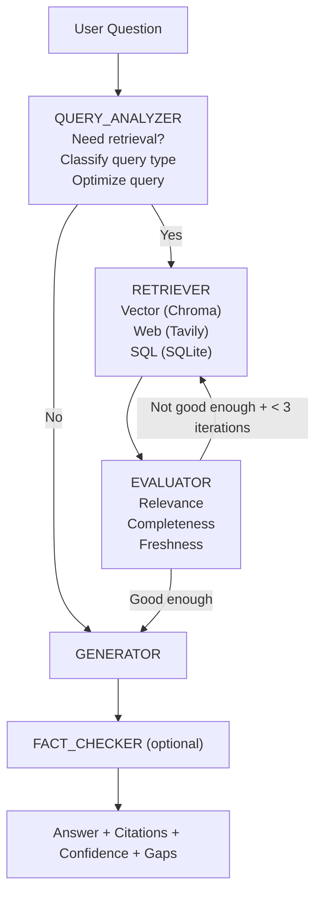

# Agentic RAG Engine 🤖📚

[](https://opensource.org/licenses/Apache-2.0)
[](https://www.python.org/)
[](https://fastapi.tiangolo.com/)

Welcome to **Agentic RAG Engine**! While traditional Retrieval-Augmented Generation (RAG) retrieves context blindly on every single query, **Agentic RAG** is smarter. It uses a Large Language Model (LLM) agent to dynamically decide:
- Whether retrieval is actually necessary.
- What query string to use for retrieval.
- Which specific data sources to consult (Vector DB, Web, or SQL).
- Whether the retrieved results are relevant and sufficient.
- When to pause, re-query, or refine its search.

This project implements a robust production loop: `retrieve -> evaluate -> refine -> re-retrieve` utilizing **LangGraph**.

---

## 🎯 Features

- **Intelligent Query Analysis:** Classifies user queries and formulates optimized search queries.
- **Multi-Source Retrieval:** Seamlessly integrates with multiple data sources:
  - Vector Embeddings (via [ChromaDB](https://www.trychroma.com/))
  - Web Search (via [Tavily](https://tavily.com/))
  - Structured SQL Databases (via SQLite)
- **Self-Evaluation & Refinement:** Built-in evaluators to score the relevance, completeness, and freshness of information before generating an answer.
- **Fact-Checking:** Optional verification layer to ensure generated answers are backed by retrieved citations without hallucinations.
- **Interactive UI & API:** Comes with both a FastAPI-powered REST API and an intuitive Streamlit interface for demonstrations.

---

## 🧠 Architecture Flow

The decision flow is modeled using a directed graph where state transitions depend on the Agent's evaluation scores.



### Graph State Variables
- `query`: The optimized search term.
- `retrieved_docs`: Documents gathered from varying sources.
- `evaluation`: Evaluator metrics (relevance, completeness, freshness).
- `answer`: Generated textual response.
- `sources`: Citations used for formulating the answer.
- `iteration_count`: Current loop count to prevent infinite retrieval cycles.

---

## 📂 Project Structure

```text
Basic Implementation of Rag/
│
├── src/                      # Source code for the core application
│   ├── graph/                # LangGraph nodes, state definitions, and workflow
│   │   ├── state.py
│   │   ├── nodes.py
│   │   └── workflow.py
│   ├── retrievers/           # Retrieval logic for different sources
│   │   ├── vector.py
│   │   ├── web.py
│   │   └── sql.py
│   ├── evaluators/           # Evaluation metric logic
│   │   ├── relevance.py
│   │   └── completeness.py
│   ├── api.py                # FastAPI endpoints
│   └── demo.py               # Streamlit web application
│
├── data/                     # Local data storage (ChromaDB vectors, SQLite)
├── examples/                 # Example scripts and notebooks
├── tests/                    # Pytest test suite
├── requirements.txt          # Python dependencies
├── README.md                 # Project Overview (You are here!)
├── LICENSE                   # Apache 2.0 License
└── all_in_once.sh            # Setup & execution shell script
```

---

## 🚀 Getting Started

### 1️⃣ Prerequisites & Installation

It is recommended to use a virtual environment. Install the required dependencies:

```bash
python -m venv .venv
source .venv/bin/activate  # On Windows use: .venv\Scripts\activate
pip install -r requirements.txt
```

### 2️⃣ Environment Configuration

You'll need API keys for the intelligent agents and external retrieval tools to function. Set the following environment variables:

```bash
export OPENAI_API_KEY="your-openai-api-key"
export TAVILY_API_KEY="your-tavily-api-key"
export OPENAI_MODEL="gpt-4o-mini" # or another compatible model
```

*Note: Without valid API keys, the engine will attempt to run with deterministic fallbacks but functionality will be severely limited.*

### 3️⃣ Running the Application

You can interface with the Agentic RAG engine via REST API or through a visual Streamlit chat interface.

#### Option A: FastAPI Server
Start the REST API server:
```bash
uvicorn src.api:app --reload --port 8000
```
Test the API endpoint:
```bash
curl -X POST http://localhost:8000/query \
  -H "Content-Type: application/json" \
  -d '{"question":"What are the latest database benchmark trends in 2026?", "sources":["web","vector"], "max_iterations":3}'
```

#### Option B: Streamlit Web UI
Start the interactive dashboard:
```bash
streamlit run src/demo.py
```
*Features included in the UI:*
- Upload custom documents (`.pdf`, `.txt`, `.md`).
- Multi-turn conversational chat.
- Trace viewer for the backend retrieval graph.
- Visibility into citations, confidence scores, and consultation sources.

---

## 🧪 Testing

Run the local test suite using `pytest`:

```bash
pytest -q
```

---

## 📄 License

This project is licensed under the **Apache License 2.0**. See the [LICENSE](LICENSE) file for more details.

---

## 🤝 Contributing

Contributions, issues, and feature requests are welcome! Feel free to check the issues page or submit a pull request if you'd like to improve the architecture or add new retrievers.
